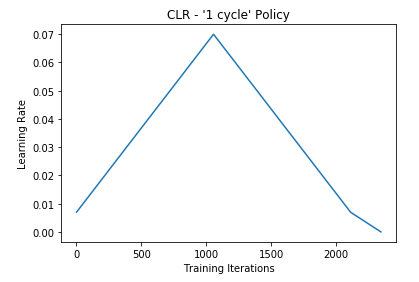
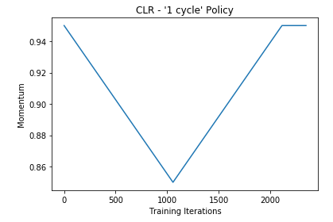

# OneCycle

This is a Keras callback for the 1-cycle policy

## Usage

### Create a network

`model = Net()`


### Create the OneCycle callback

```
sched = OneCycle(min_lr=7e-3, max_lr=7e-2, min_mtm = 0.85, max_mtm = 0.95, annealing_stage=0.1, annealing_rate=0.01,
          training_iterations=np.ceil(((X_train.shape[0]*epochs)/(batch_size))))
```

### Pass the callback as an argument when training the network

`model.fit(X_train, y_train, batch_size=batch_size, epochs=epochs, validation_data=(X_test, y_test), callbacks=[sched])`





## References

This code is based on:

- This paper: https://arxiv.org/pdf/1803.09820.pdf
- The blog of Sylvain Gugger : https://sgugger.github.io

